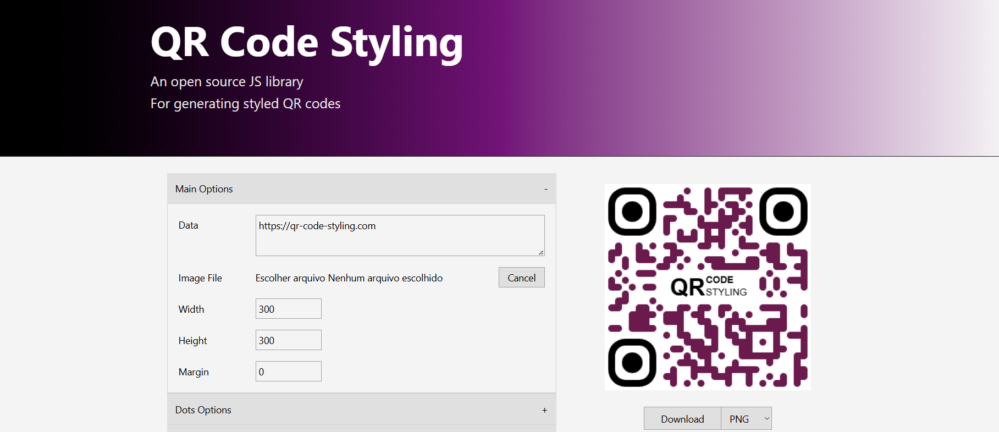

# 🔳 QR Code Styling: Customizable Generator & Library Clone

## 📝 Descrição do Projeto
O **QR Code Styling Clone** é um WebApp utilitário focado na geração e personalização avançada de QR Codes. O sistema foi desenvolvido fundamentado na engenharia reversa de uma referência visual de "Raw/HTML Padrão", unindo uma estética minimalista, purista e de alta acessibilidade com um motor moderno de renderização sob o capô.

Desenvolvido para oferecer controle total sobre a construção visual do QR Code, o dashboard processa alterações de estado em tempo real, permitindo aos usuários configurar desde a espessura geométrica dos pontos (Dots) até regras de preenchimento dos cantos geométricos, gerando saídas de altíssima fidelidade prontas para impressão ou distribuição digital.

---

*Figura 1: Interface principal em duas colunas integrando accordions de configuração geométrica e visualizador de QR Code em tempo real.*

## 🚀 Tecnologias Utilizadas
* **Frontend:** React 18 + TypeScript + Vite
* **Estilização:** Tailwind CSS (Arquitetura Utilitária focada em design raw/minimalista)
* **Gerenciamento de Estado:** Zustand (Store global emulando as opções puras da biblioteca)
* **Motor de Renderização Core:** `qr-code-styling` (Biblioteca JS Open Source)
* **Estrutura Visual:** HTML Nativo-Like (inputs unstyled, sem shadows, bordas utilitárias)

## 📊 Resultados e Funcionalidades
O projeto foi estruturado com foco em Clean Code (Alta Coesão e Baixo Acoplamento), garantindo uma experiência fluida:
* **Customização Multi-Escalar:** Controle profundo sobre `Dots` (formas como rounded, classy, extra-rounded), `Corners` (miolo e borda externa isolados) e suporte total a injeção de Imagens/Logos (com limpeza de área de colisão).
* **Renderização Síncrona:** A implementação de estado com Zustand aliada ao React Refs garante que o preview 2D do QR Code em tela responda instantaneamente, sem atrasos nas recomposições.
* **Fidelidade Estética Utilitária:** Componentes UI que simulam o comportamento bruto da web antiga, criando interfaces rápidas, de baixo processamento e livres de overhead de design systems pesados.
* **Motor Múltiplo de Exportação:** Downloads otimizados em densidade de pixels (PNG, JPEG, WEBP, SVG) e serialização estruturada, com a capacidade de extrair as definições via formato JSON.

*Figura 2: Análise técnica dos componentes de input integrados para transição entre cores puras e propriedades de gradiente.*

## 🔧 Como Executar
1. Clone o repositório para a sua máquina local.
2. Acesse o diretório do projeto via terminal.
3. Instale as dependências executando: `npm install`
4. Inicie o servidor de desenvolvimento ultra-rápido: `npm run dev`
5. Acesse na porta disponibilizada no terminal (normalmente `http://localhost:5173/` ou `http://localhost:3000/`)

*Figura 3: Representação da arquitetura isolando os componentes UI (esquerda) do Core engine do QR-Code-Styling (direita).*

---
[Voltar ao início](#) <!-- Substitua pelo link do seu portfólio -->
